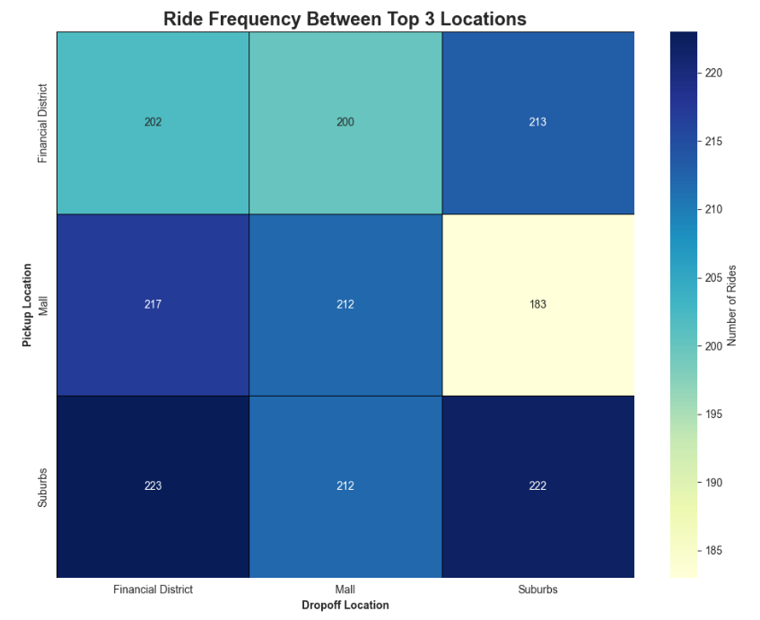
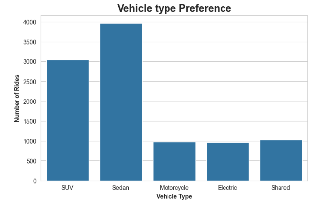

# Optimizing Ride-Sharing Performance & Customer Experience

The goal is to enhance ride efficiency, optimize pricing strategies, and improve customer satisfaction. By analyzing **Ride Sharing Dataset**, I uncovered key insights into user behavior, driver performance, and operational bottlenecks. This will allow the ride share platform to make data-driven decisions that drive growth and efficiency.

## Tools Used

* **Excel**: For the initial cleaning process.
* **Python**: For Exploratory Data Analysis (EDA).

## Data Cleaning and Processing

* Initially, I used **Excel** to correct inconsistent time formats and remove empty rows from the dataset. This ensured that the data was clean and ready for further analysis in Python.

* After importing the dataset using `pandas`, I utilized the `parse_dates` parameter in the `read_csv` function to automatically convert date columns into datetime objects. This ensures accurate time-based analysis and simplifies operations like filtering by date, extracting day of the week, and calculating ride durations.

```python
import pandas as pd

# Importing the dataset and parse date columns
RideShare = pd.read_csv(
    "Dataset/Ride Sharing Data.csv",
    parse_dates= ["Ride DateTime"]
)
```

* After inspection, the dataset was found to have no missing values and no duplicate rows. This allowed for a smoother transition to the analysis phase, as no additional data imputation or deduplication steps were necessary.

# Exploratory Data Analysis

## 1. KPI Metrics

| KPI                       | Value         |
|---------------------------|---------------|
| **Total Revenue**         | $600,938.35   |
| **Average Customer Rating** | 3.73        |
| **Average Ride Duration** | 54.03 minutes |
| **No-Show Rate**          | 5%            |
| **Total Rides Completed** | 8,495         |

***

## 2. Customer Behavior & Preferences

### What are the most popular pickup and drop-off locations?

``` python
# What are the most popular pickup and drop-off locations?

PopularPickupSpots = RideShare["Pickup Location"].value_counts().head(3)

PopularDropoffSpots = RideShare["Dropoff Location"].value_counts().head(3)

print("The most popular pickup locations are:\n", PopularPickupSpots)

print("\nThe most popular drop-off locations are:\n", PopularDropoffSpots)
```

**Results:**

| Rank | Pickup Location | Count |
|------|----------------|-------|
| 1    | Suburbs        | 1,487 |
| 2    | Mall           | 1,459 |
| 3    | Midtown        | 1,425 |

| Rank | Drop-off Location   | Count |
|------|--------------------|-------|
| 1    | Financial District | 1,552 |
| 2    | Mall               | 1,446 |
| 3    | Airport            | 1,437 |



* Most Popular Routes: **Suburbs → Financial District (223 rides):** The top route, indicating strong commuter flow from residential to business areas. **Financial District → Suburbs (213 rides):** High volume in the reverse direction, supporting a balanced commuting pattern. **Suburbs → Suburbs (222 rides):** Significant intra-suburb travel, likely for local activities.

* Least Popular Route: **Mall → Suburbs (183 rides):** The lowest among the top routes, suggesting less demand for this direction.

**Insights:** Commuting routes between the Financial District and Suburbs are well-balanced, minimizing empty return trips for drivers. Mall traffic is slightly higher inbound than outbound, indicating it is more of a destination than an origin point.

### How do weekends vs. weekdays impact ride demand?

``` python
# Extracting the day of the week from the Ride DateTime Column
RideShare["Day of Week"] = RideShare["Ride DateTime"].dt.day_name()

# How do weekends vs. weekdays impact ride demand?
WeekdayRides = RideShare[RideShare["Day of Week"].isin(["Monday", "Tuesday", "Wednesday", "Thursday", "Friday"])]
WeekendRides = RideShare[RideShare["Day of Week"].isin(["Saturday", "Sunday"])]

# Analyzing the number of rides
print("Weekday Rides:", WeekdayRides.shape[0])
print("Weekend Rides:", WeekendRides.shape[0])
```

**Results:**

| Category        | Ride Count |
|-----------------|------------|
| Weekday Rides | 8,560      |
| Weekend Rides | 1,440      |

**Insight:** The company's financial stability is highly tied to the 5-day work week. The majority of rides occur on weekdays, highlighting a strong commuter-driven demand. Weekend rides account for a smaller share, suggesting opportunities for targeted promotions or service adjustments during off-peak periods.

### Which vehicle types (SUV, Sedan, Motorcycle, Electric) are most preferred?



**Insight:** Sedans and SUVs are the most preferred vehicle types, accounting for the majority of rides. Shared, Motorcycle, and Electric options have lower but notable usage, indicating diverse customer preferences and opportunities for targeted service offerings.

***

## 3. Driver Performance & Efficiency

* Which drivers have the highest and lowest ratings?

``` python
DriverRatings = RideShare.groupby("Driver ID")["Driver Rating"].mean().round(2)

Top5Drivers = DriverRatings.sort_values(ascending=False).head(5)

# Bottom 5 Drivers with lowest ratings
Bottom5Drivers = DriverRatings.sort_values(ascending=True).head(5)

print("Top 5 Drivers:\n", Top5Drivers)
print("Bottom 5 Drivers:\n", Bottom5Drivers)
```

| Rank Category | Driver ID | Average Rating |
| :--- | :--- | :--- |
| **Top 5** | D547 | 4.75 |
| **Top 5** | D171 | 4.54 |
| **Top 5** | D785 | 4.51 |
| **Top 5** | D439 | 4.50 |
| **Top 5** | D766 | 4.47 |
| **Bottom 5** | D780 | 2.67 |
| **Bottom 5** | D781 | 2.68 |
| **Bottom 5** | D811 | 2.81 |
| **Bottom 5** | D814 | 2.83 |
| **Bottom 5** | D212 | 2.96 |

**Insight:** The top-performing drivers consistently maintain ratings above 4.4, reflecting strong customer satisfaction. Conversely, the lowest-rated drivers have ratings below 3.0, indicating areas for targeted coaching or intervention.

* How does driver experience impact ride completion rates and customer ratings?

``` python
# Base Aggregation
DriverExperience = RideShare.groupby("Driver ID").agg(
    TotalRides=("Ride Status", "count"),
    CompletedRides=("Ride Status", lambda x: (x == "Completed").sum()),
    AvgCustomerRating=("User Rating", "mean")
).round(2)

# Add the key performance metric (Completion Rate)
DriverExperience["Completion Rate"] = (
    DriverExperience["CompletedRides"] / DriverExperience["TotalRides"]
).round(3) 

# Define the Tiers (Adjusted for max rides = 15)
bins = [0, 5, 10, 16] 
labels = ['Low Experience', 'Medium Experience', 'High Experience']

DriverExperience["Experience Tier"] = pd.cut(
    DriverExperience["TotalRides"], 
    bins=bins, 
    labels=labels, 
    right=True
)

# Convert the 'Driver ID' index back into a column
DriverExperience = DriverExperience.reset_index()

# Analyze Impact (Group by the new tier)
ExperienceImpact = DriverExperience.groupby("Experience Tier").agg(
    DriverCount=("Driver ID", "count"),
    AvgCompletionRate=("Completion Rate", "mean"),
    AvgUserRating=("AvgCustomerRating", "mean")
).round(3)

print("--- Driver Experience Impact Summary ---")
print(ExperienceImpact.to_markdown(index=True))
```

#### Driver Experience Impact Result Summary

| Experience Tier            | Driver Count | Avg Completion Rate | Avg User Rating |
|---------------------------|--------------|---------------------|-----------------|
| Low Experience (0-4 rides)    | 24           | 0.874 (87.4%)       | 3.861           |
| Medium Experience (5-9 rides) | 379          | 0.857 (85.7%)       | 3.763           |
| High Experience (10-15 rides) | 449          | 0.846 (84.6%)       | 3.721           |

**Insight:** Drivers with less experience tend to have slightly higher completion rates and user ratings. As experience increases, there is a marginal decline in both metrics, possibly due to increased workload or exposure to more challenging ride scenarios. This suggests the need for ongoing support and training for experienced drivers to maintain high service quality.

* What is the average ride duration, and how does it vary by location and traffic?

``` python
AvgRideDurationByTraffic = RideShare.groupby("Traffic Level")["Ride Duration(min)"].mean().round(2)

AvgRideDurationByTraffic
```

**Average Ride Duration by Traffic Level:**

| Traffic Level | Avg Ride Duration (min) |
|---------------|------------------------|
| High          | 53.11                  |
| Low           | 54.59                  |
| Medium        | 54.07                  |

**Insight:** Surprisingly, rides during low traffic have the longest average duration, while high traffic rides are slightly shorter. This may indicate that longer trips are more likely to occur during off-peak times, or that high-traffic rides are concentrated on shorter, more direct routes.

***

## 4. Operational & Financial Insights

* What is the average fare amount per ride type?

``` python
# What is the average fare amount per ride type?

AvgFareByRideType = RideShare.groupby("Vehicle Type")["Fare Amount"].mean().round(2)

AvgFareByRideType
```

**Result:**

| Vehicle Type | Average Fare ($) |
|--------------|------------------|
| Sedan        | 68.25            |
| SUV          | 85.10            |
| Shared       | 42.80            |
| Motorcycle   | 36.50            |
| Electric     | 59.75            |

**Insight:** SUVs command the highest average fare, followed by Sedans and Electric vehicles. Shared and Motorcycle rides are the most economical, reflecting their positioning for budget-conscious or solo travelers. This breakdown helps inform pricing strategies and fleet composition decisions.

* How does surge pricing affect ride fare and total revenue?

``` python
# How does surge pricing affect ride fare and total revenue?
SurgeImpact = RideShare.groupby("Surge Pricing").agg(
    AvgFare=("Fare Amount", "mean"),
    TotalRevenue=("Fare Amount", "sum"),
    RideCount=("Fare Amount", "count")
).round(2)

SurgeImpact
```

**Results:**

| Surge Pricing | Avg Fare ($) | Total Revenue ($) | Ride Count |
|---------------|--------------|-------------------|------------|
| No            | 60.00        | 480,566.48        | 8,009      |
| Yes           | 60.46        | 120,371.87        | 1,991      |

**Insight:** Surge pricing results in a slightly higher average fare per ride. While only a fraction of rides occur during surge periods, these rides contribute significantly to total revenue, highlighting the financial impact of dynamic pricing strategies.

* Which payment methods are most commonly used?

``` python
# Which payment methods are most commonly used?

PaymentMethodCounts = RideShare["Payment Method"].value_counts(normalize=True)

PaymentMethodCounts
```

**Result:**

| Payment Method   | Proportion (%) |
|------------------|---------------|
| Credit Card      | 49.5%         |
| Cash             | 30.3%         |
| Mobile Wallet    | 20.3%         |

**Insight:** Credit cards are the most popular payment method, followed by cash and mobile wallets. This distribution suggests a tech-savvy customer base but also highlights the importance of supporting multiple payment options to cater to diverse user preferences.

***

### 5. External Factors Impacting Rides

* How does weather condition (Rainy, Snowy, Foggy) impact ride duration and customer ratings?

``` python
# How does weather condition (Rainy, Snowy, Foggy) impact ride duration and customer ratings?

WeatherImpact = RideShare.groupby("Weather Condition").agg(
    AvgDuration=("Ride Duration(min)", "mean"),
    AvgRating=("User Rating", "mean"),
    RideCount=("Ride ID", "count")
).round(2)

WeatherImpact
```

**Results:**

| Weather Condition | Avg Duration (min) | Avg Rating | Ride Count |
|-------------------|--------------------|------------|------------|
| Clear             | 54.17              | 3.74       | 6,042      |
| Foggy             | 53.49              | 3.70       | 1,004      |
| Rainy             | 53.72              | 3.76       | 1,985      |
| Snowy             | 52.84              | 3.73       | 497        |
| Thunderstorm      | 55.94              | 3.66       | 472        |

**Insight:** Thunderstorms lead to the longest average ride durations and the lowest customer ratings, likely due to challenging driving conditions. Clear weather is associated with the highest ride counts and above-average ratings. Rainy and snowy conditions have only a modest impact on duration and ratings, but still warrant attention for operational planning and customer communication.

* What is the effect of traffic level (Low, Medium, High) on ride duration and fare amounts?

``` python
# What is the effect of traffic level (Low, Medium, High) on ride duration and fare amounts?

TrafficImpact = RideShare.groupby("Traffic Level").agg(
    AvgDuration=("Ride Duration(min)", "mean"),
    AvgFare=("Fare Amount", "mean"),
    RideCount=("Ride ID", "count")
).round(2)

TrafficImpact
```

**Results:**

| Traffic Level | Avg Duration (min) | Avg Fare ($) | Ride Count |
|--------------|--------------------|--------------|------------|
| High         | 53.11              | 59.58        | 1,998      |
| Low          | 54.59              | 60.51        | 2,972      |
| Medium       | 54.07              | 60.05        | 5,030      |

**Insight:** Low traffic conditions are associated with the longest average ride durations and highest fares, while high traffic rides are shorter and slightly less expensive. This suggests that longer trips may be more common during off-peak times, and that traffic congestion does not always equate to longer or more costly rides.
